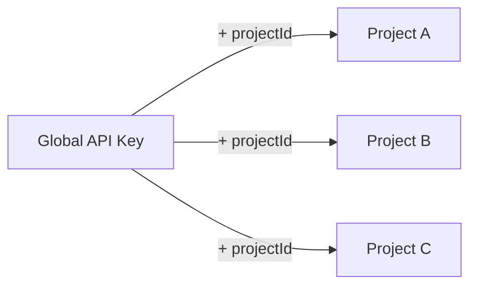

A **global API key** is a data-plane key that authenticates across **every project in your organization**, so you don't need to create and manage a separate key for each project.

Because a global key isn't tied to a single project, you tell Confident AI which project each request targets by passing a `projectId`.



Confident AI has three kinds of API keys, each scoped differently:

- **Organization API key** — tied to one organization, used for account-wide administration with the [Admin SDK](/docs/settings/project/management/api-keys).
- **Project API key** — tied to a single project, used for traces and evaluations in that project.
- **Global API key** — works across all projects in your organization, used for traces and evaluations in any project, selected per request with `projectId`.

## Create a Global API Key

Global API keys are created from the Confident AI dashboard:

1. Navigate to **Organization Settings** → **Global API Keys**
2. Click **Generate New Global API Key** and give it a name
3. Copy the key value and store it securely

<Warning>
  The full secret `value` is **only shown when the key is created**. Store it
  securely at creation time.
</Warning>

## Use a Global API Key

Set the global key as your `CONFIDENT_API_KEY`, then pass `projectId` to target a specific project on each call.

<Tabs>
  <Tab title="TypeScript" language="typescript">

```typescript
import { Prompt, EvaluationDataset } from "deepeval";

// Pull a prompt from a specific project
const prompt = new Prompt({ alias: "YOUR-PROMPT-ALIAS" });
await prompt.pull({ projectId: "YOUR-PROJECT-ID" });

// Pull a dataset from a specific project
const dataset = new EvaluationDataset();
await dataset.pull({ alias: "YOUR-DATASET-ALIAS", projectId: "YOUR-PROJECT-ID" });
```

  </Tab>
  <Tab title="curL" language="curl">

```bash
curl https://api.confident-ai.com/v1/prompts/YOUR-PROMPT-ALIAS/commits/latest \
  -H "CONFIDENT_API_KEY: <GLOBAL-API-KEY>" \
  -H "CONFIDENT_PROJECT_ID: <YOUR-PROJECT-ID>"
```

  </Tab>
</Tabs>

`projectId` is accepted by every data method — `pull`, `push`, `evaluate`, and so on. A global key **requires** a `projectId` on every request, and calls sent without one are rejected since the key isn't bound to a single project. With a regular project-scoped key you omit `projectId`, and each call targets that key's project automatically.

<Warning>
  Global keys are not yet wired into background trace ingestion, so sending
  traces to a chosen project with a global key isn't supported yet. Use a
  project API key for tracing.
</Warning>
