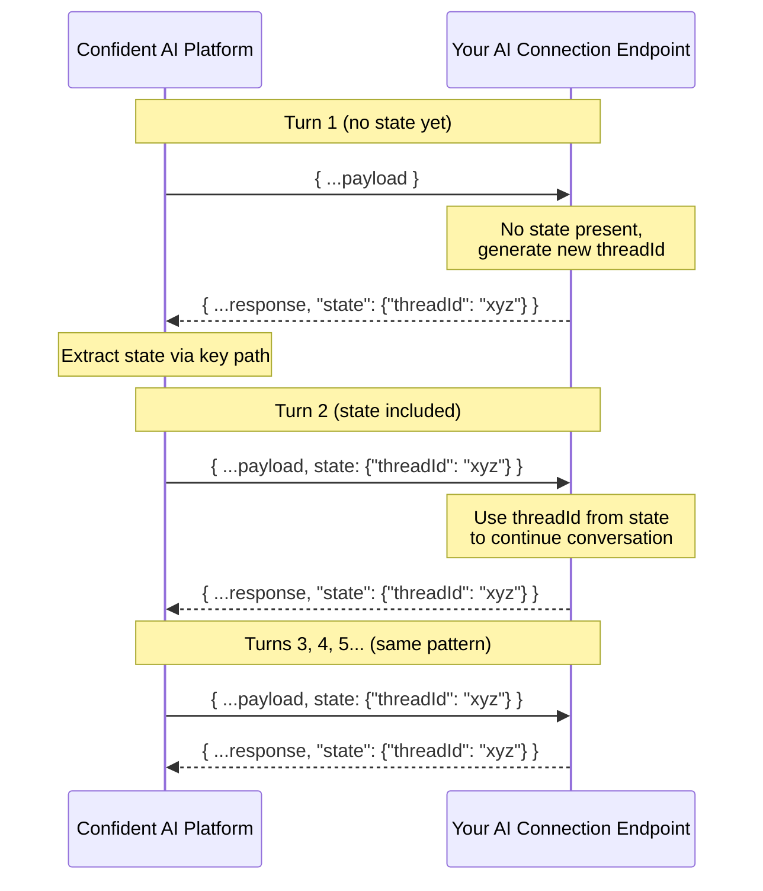
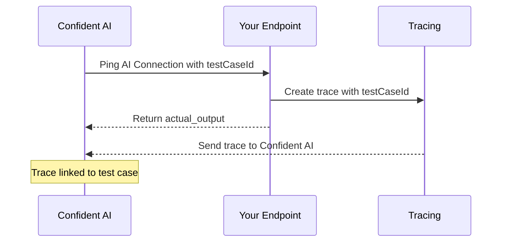

AI Connections let you run evaluations directly on the platform by connecting to your AI app via an HTTPS endpoint. Instead of writing code, you can trigger evaluations with a click of a button—Confident AI will call your endpoint with data from your goldens and parse the response.

<Frame caption="Setup AI Connection">
  
</Frame>

## Setting Up an AI Connection

To create an AI connection:

1. Navigate to **Project Settings** → **AI Connections**
2. Click **New AI Connection**
3. Give it a unique identifying name
4. Click **Save**

<Note>
  Your AI connection won't be usable yet—you still need to configure the
  endpoint, payload, and at minimum the actual output key path.
</Note>

## Configuration Parameters

There are several parameters you'll need to configure in order for your AI connection to work.

### Name

Give your AI connection a unique name to identify it within your project.

### AI App Endpoint

Your AI app **must be accessible via an HTTPS endpoint** that accepts `POST` requests and returns a JSON response containing the actual output of your AI app.

### Payload

Configure the payload that Confident AI sends to your endpoint. You can customize this to match your API's expected structure using values from your goldens. There are two ways to configure your payload: the **JSON editor** and the **code editor**.

<Tabs>

  <Tab title="JSON Editor">

The JSON editor lets you visually construct the payload using golden variables. This is the default and works well for most use cases.

Available variables:

| Variable                                        | Description                                              | Type       |
| ----------------------------------------------- | -------------------------------------------------------- | ---------- |
| `golden.input`                                  | The input from your golden                               | string     |
| `golden.actual_output`                          | The actual output from your golden                       | string     |
| `golden.expected_output`                        | The expected output from your golden                     | string     |
| `golden.retrieval_context`                      | The retrieval context from your golden                   | string[]   |
| `golden.context`                                | The context from your golden                             | string[]   |
| `golden.expected_tools`                         | The expected tools from your golden                      | ToolCall[] |
| `golden.tools_called`                           | The tools called from your golden                        | ToolCall[] |
| `golden.additional_metadata`                    | Additional metadata from your golden                     | object     |
| `golden.custom_column_key_values`               | Custom column key-value pairs from your golden           | object     |
| `conversationalGolden.turns`                    | Turn history for multi-turn evals                        | Turn[]     |
| `conversationalGolden.context`                  | Context for conversational goldens                       | string[]   |
| `conversationalGolden.scenario`                 | Scenario for conversational goldens                      | string     |
| `conversationalGolden.expected_outcome`         | Expected outcome for conversational goldens              | string     |
| `conversationalGolden.user_description`         | User description for conversational goldens              | string     |
| `conversationalGolden.additional_metadata`      | Additional metadata for conversational goldens           | object     |
| `conversationalGolden.custom_column_key_values` | Custom column key-value pairs for conversational goldens | object     |
| `prompts`                                       | A dictionary of prompts                                  | object     |
| `testCaseId`                                    | Unique identifier for linking traces to test cases       | string     |
| `state`                                         | An object to keep state for multi-turn simulations       | object     |
| `hyperparameters`                               | Hyperparameters configured on the AI connection          | object     |

Example payload:

```json
{
  "input": golden.input,
  "context": golden.context,
  "conversationalContext": conversationalGolden.context,
  "prompts": prompts,
  "turns": conversationalGolden.turns
}
```

Use `golden.*` variables for single-turn evaluations and `conversationalGolden.*` variables for multi-turn evaluations. See [Prompts](#prompts) for details on how to use the `prompts` dictionary.

  </Tab>

  <Tab title="Code Editor">

The code editor gives you full flexibility to construct your payload using Python. Define a `generate_payload` function that receives the golden (either single-turn or conversational) along with optional parameters, and returns a dictionary that becomes the request body sent to your endpoint.

Here's the default implementation:

```python
from deepeval import Golden, ConversationalGolden

def generate_payload(
    golden: Union[Golden, ConversationalGolden],
    prompts: Optional[Dict[str, str]] = None,
    testCaseId: Optional[str] = None,
    state: Optional[Any] = None,
) -> dict:

    if isinstance(golden, Golden):
        return {
            "input": golden.input,
            "context": golden.context,
            "prompts": prompts
        }

    elif isinstance(golden, ConversationalGolden):
        return {
            "turns": golden.turns,
            "conversationContext": golden.context,
            "prompts": prompts
        }
```

The `golden` parameter is a `Union[Golden, ConversationalGolden]`—use `isinstance` to check which type you're working with and construct the appropriate payload. This is especially powerful when you need to:

- Apply conditional logic or transformations before sending data
- Access `golden.custom_column_key_values` to include custom dataset columns
- Combine multiple golden fields into a single payload key
- Handle single-turn and multi-turn payloads with different structures

Here's an example that uses custom columns and state:

```python
from deepeval import Golden, ConversationalGolden

def generate_payload(
    golden: Union[Golden, ConversationalGolden],
    prompts: Optional[Dict[str, str]] = None,
    testCaseId: Optional[str] = None,
    state: Optional[Any] = None,
) -> dict:

    if isinstance(golden, Golden):
        custom = golden.custom_column_key_values or {}
        return {
            "input": golden.input,
            "context": golden.context,
            "language": custom.get("language", "en"),
            "region": custom.get("region"),
            "prompts": prompts,
            "testCaseId": testCaseId,
        }

    elif isinstance(golden, ConversationalGolden):
        custom = golden.custom_column_key_values or {}
        return {
            "turns": golden.turns,
            "conversationContext": golden.context,
            "scenario": golden.scenario,
            "difficulty": custom.get("difficulty"),
            "prompts": prompts,
            "state": state,
        }
```

<Note>
  `golden.custom_column_key_values` is a dictionary containing any custom
  columns you've defined in your dataset. This lets you pass arbitrary data
  through to your endpoint without needing to fit it into the standard golden
  fields.
</Note>

  </Tab>

</Tabs>

<Tip>
  The custom payload feature lets you structure the request to match your
  existing API contract—no need to modify your AI app to accept a specific
  format.
</Tip>

### Headers

Add any headers required by your endpoint, such as API keys, authentication tokens, or content type specifications. These headers are sent with every request to your AI app.

### Prompts

Associate prompt versions with your AI connection. When running evaluations, these prompts will be attributed to each test run, letting you trace results back to the prompts used.

The `prompts` variable in your payload is a dictionary where each key maps to an object containing `alias` and `version`:

```json
{
  "system": { "alias": "system-prompt", "version": "1.0.0" },
  "assistant": { "alias": "assistant-prompt", "version": "2.1.0" }
}
```

Here's an example of how your Python endpoint might handle the prompts dictionary:

```python
from deepeval.prompt import Prompt

@app.post("/generate")
def generate(request: dict):
    # Pull different prompt versions using their keys
    system_info = request["prompts"]["system"]
    assistant_info = request["prompts"]["assistant"]

    system_prompt = Prompt(alias=system_info["alias"]).pull(version=system_info["version"])
    assistant_prompt = Prompt(alias=assistant_info["alias"]).pull(version=assistant_info["version"])

    # Use the prompts in your generation
    response = llm.generate(
        system=system_prompt.text,
        assistant=assistant_prompt.text,
        user=request["input"]
    )

    return {"output": response}
```

For more details on working with prompts, see [Prompt Versioning](/docs/llm-evaluation/prompt-management/version-prompts).

### Hyperparameters

Associate hyperparameters with your AI connection to track LLM configuration settings like model name, temperature, and other parameters across evaluation runs. When running evaluations, these hyperparameters are automatically attributed to each test run.

To include hyperparameters in the payload sent to your endpoint, add the `hyperparameters` variable to your payload configuration. The value is a dictionary of string key-value pairs:

```json
{
  "model": "gpt-4o",
  "temperature": "0.7",
  "max_tokens": "1024"
}
```

### Actual Output Key Path

A list of strings or integers representing the path to the `actual_output` value in your JSON response. Use strings for JSON keys and integers for array indices. This is required for evaluation to work.

For example, if your endpoint returns:

```json
{
  "response": {
    "output": "Hello, world!"
  }
}
```

Set the key path to `["response", "output"]`.

For nested arrays, use integers to specify the array index. For example, if your endpoint returns:

```json
{
  "response": {
    "output": {
      "content": [{ "text": "Hello, world!" }]
    }
  }
}
```

Set the key path to `["response", "output", "content", 0, "text"]`.

<Frame caption="Key paths support both JSON keys (strings) and list indices (integers)">
  
</Frame>

### Retrieval Context Key Path

A list of strings or integers representing the path to the `retrieval_context` value in your JSON response. Use strings for JSON keys and integers for array indices. This is optional and only needed if you're using RAG metrics. The value must be a list of strings.

For example, if your endpoint returns:

```json
{
  "response": {
    ...
    "retrieval_context": ["context1", "context2"]
  }
}
```

Set the key path to `["response", "retrieval_context"]`.

### Tool Call Key Path

A list of strings or integers representing the path to the `tools_called` value in your JSON response. Use strings for JSON keys and integers for array indices. This is optional and only needed if you're using metrics that require a tool call parameter. The value must be a list of `ToolCall`.

For example, if your endpoint returns:

```json
{
  "response": {
    ...
    "tools_called": [
      {
        "name": "get_weather",
        "description": "Get weather for a location",
        "reasoning": "User asked about the weather in San Francisco",
        "output": "Sunny, 72°F",
        "inputParameters": {"location": "San Francisco"}
      }
    ]
  }
}
```

Set the key path to `["response", "tools_called"]`.

<Tip>
  For more information on the structure of a tool call, refer to the [official
  DeepEval
  documentation](https://deepeval.com/docs/evaluation-test-cases#tools-called).
</Tip>

### Request Timeout

Set the maximum time (in seconds) that Confident AI will wait for your endpoint to respond before timing out. This helps prevent evaluations from hanging indefinitely if your AI connection is slow or unresponsive.

- **Minimum**: 1 second
- **Default**: 60 seconds

<Note>
  If your AI app performs complex operations or calls external services, you may
  need to increase the timeout to avoid premature failures.
</Note>

### Max Concurrency

Set the maximum number of concurrent requests that Confident AI will send to your endpoint at the same time. This helps prevent overwhelming your AI app during large evaluation runs.

- **Minimum**: 1
- **Default**: 20

### Max Retries

Set the maximum number of times Confident AI will retry a failed request to your endpoint. This helps handle transient errors without failing the entire evaluation.

- **Minimum**: 0
- **Default**: 0

## Configure Multiturn State

During multi-turn simulations, Confident AI calls your endpoint once per turn. You can use state to persist information—like a thread ID or session—across turns so your AI app can maintain context throughout the conversation.

On the **first turn**, the `state` variable in your payload will be empty since no prior state exists. If your endpoint returns a state object and the state key path successfully extracts it, that state will be included in the `state` payload variable from the **second turn onwards**.



### Payload

To enable multiturn state, include `state` in your payload configuration so it gets sent to your endpoint on each turn:

<Tabs>

  <Tab title="JSON Editor">

```json
{
  "input": golden.input,
  "state": state
}
```

  </Tab>

  <Tab title="Code Editor">

```python
from deepeval import Golden, ConversationalGolden

def generate_payload(
    golden: Union[Golden, ConversationalGolden],
    prompts: Optional[Dict[str, str]] = None,
    testCaseId: Optional[str] = None,
    state: Optional[Any] = None,
) -> dict:

    if isinstance(golden, ConversationalGolden):
        return {
            "turns": golden.turns,
            "conversationContext": golden.context,
            "state": state
        }
```

  </Tab>

</Tabs>

Here's an example of how your endpoint might handle state:

```python
@app.post("/generate")
def generate(request: dict):
    state = request.get("state", {})

    if not state:
        thread_id = create_new_thread()
    else:
        thread_id = state["threadId"]

    response = llm.generate(
        thread_id=thread_id,
        user=request["input"]
    )

    return {
        "output": response,
        "state": {"threadId": thread_id}
    }
```

### State Key Path

The state key path works just like the actual output key path—a list of strings or integers representing the path to the `state` object in your JSON response. This tells Confident AI where to extract state from your endpoint's response so it can be passed back on the next turn.

For example, if your endpoint returns:

```json
{
  "output": "Hello! How can I help?",
  "state": {
    "threadId": "abc-123"
  }
}
```

Set the state key path to `["state"]`.

<Note>
  State is only relevant for multi-turn evaluations (simulations). For
  single-turn evaluations, you can ignore this setting entirely.
</Note>

## Linking Test Cases to Traces

When running evaluations through an AI Connection, you can link each test case to its corresponding trace for full observability. This is done by including `testCaseId` in your payload (enabled by default) and passing it to your tracing setup.



Include `testCaseId` in your payload configuration and ensure your AI connection is configured to accept it.

```json
{
  "input": golden.input,
  "testCaseId": testCaseId
}
```

Then, pass the `testCaseId` to your tracing implementation:

<Tabs>

  <Tab title="Python">

```python
from deepeval.tracing import observe, update_current_trace

@observe()
def llm_app(input: str, test_case_id: str):
    # Link the trace to the test case
    update_current_trace(test_case_id=test_case_id)

    # Your generation logic here
    response = llm.generate(user=input)
    return response

@app.post("/generate")
def generate(request: dict):
    test_case_id = request,get("testCaseId")
    response = llm_app(request["input"], test_case_id)
    return {"output": response}
```

  </Tab>
  <Tab title="LangChain">

```python
from langchain.agents import create_tool_calling_agent, AgentExecutor
from deepeval.integrations.langchain import CallbackHandler
...

@app.post("/generate")
def generate(request: dict):
    test_case_id = request.get("testCaseId")

    result = agent_executor.invoke(
        {"input": request["input"]},
        config={"callbacks": [CallbackHandler(test_case_id=test_case_id)]}
    )
    return {"output": result["output"]}
```

  </Tab>
  <Tab title="LangGraph">

```python
from langgraph.prebuilt import create_react_agent
from deepeval.integrations.langchain import CallbackHandler
...

@app.post("/generate")
def generate(request: dict):
    test_case_id = request.get("testCaseId")

    result = agent.invoke(
        {"messages": [{"role": "user", "content": request["input"]}]},
        config={"callbacks": [CallbackHandler(test_case_id=test_case_id)]}
    )
    return {"output": result["messages"][-1].content}
```

  </Tab>
</Tabs>

<Tip>
  Once linked, you can view the full trace for each test case directly from the
  evaluation results, making it easy to debug failures and understand model
  behavior.
</Tip>

## Testing Your Connection

After configuring your AI connection, click **Ping Endpoint** to verify everything is set up correctly. You should receive a `200` status response. If not, check the error message and adjust your configuration accordingly.
