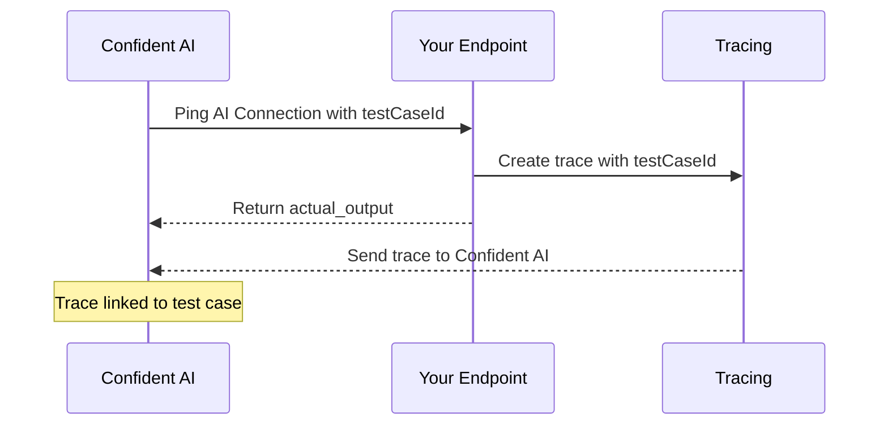
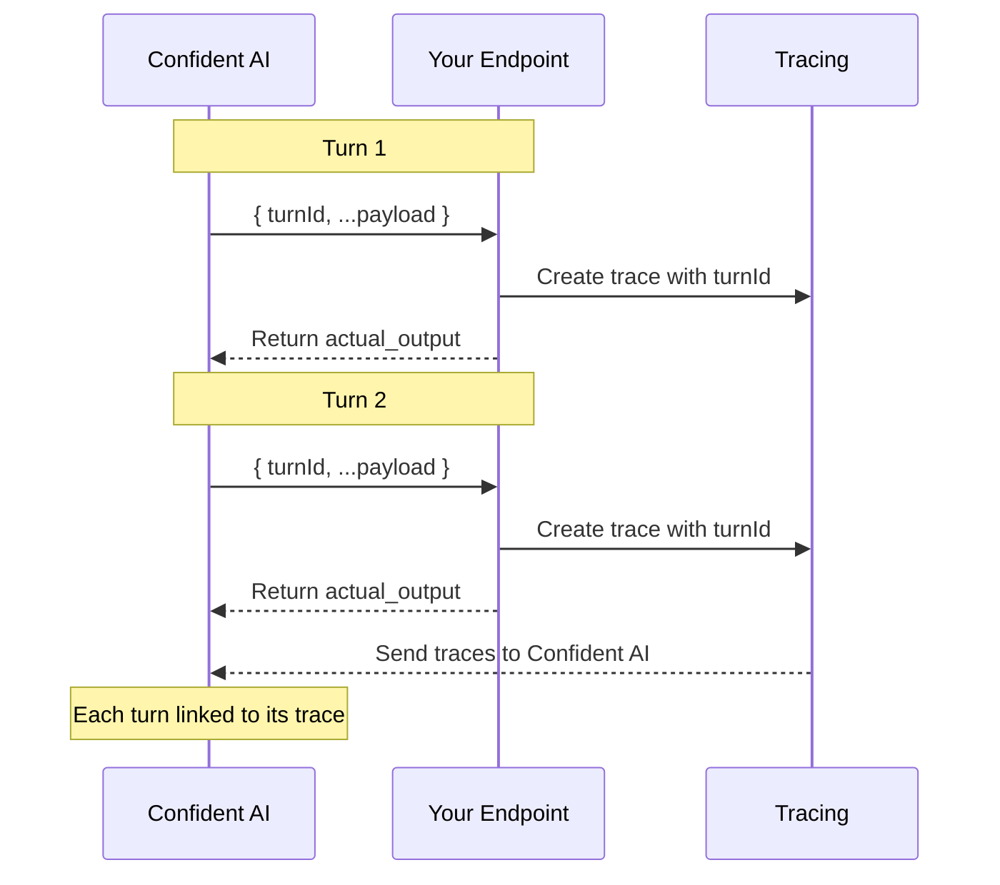

## Overview

When you run evaluations through an [AI Connection](/docs/settings/project/ai-connections), Confident AI can link each result back to the trace your AI app produced. This gives you full observability—jump straight from an evaluation result to the exact trace that generated it.

There are two flavors of trace linking:

- **Linking test cases to traces** for single-turn evaluations
- **Linking turns to traces** for multi-turn evaluations and red-team attacks

Both work by passing an identifier (`testCaseId` or `turnId`) from your payload into your tracing setup.

## Linking Test Cases to Traces

For single-turn evaluations, you can link each test case to its corresponding trace for full observability. This is done by including `testCaseId` in your payload (enabled by default) and passing it to your tracing setup.



Include `testCaseId` in your payload configuration and ensure your AI connection is configured to accept it.

```json
{
  "input": golden.input,
  "testCaseId": testCaseId
}
```

Then, pass the `testCaseId` to your tracing implementation:

<Tabs>

  <Tab title="Python">

```python
from deepeval.tracing import observe, update_current_trace

@observe()
def llm_app(input: str, test_case_id: str):
    update_current_trace(test_case_id=test_case_id)

    response = llm.generate(user=input)
    return response

@app.post("/generate")
def generate(request: dict):
    test_case_id = request.get("testCaseId")
    response = llm_app(request["input"], test_case_id)
    return {"output": response}
```

  </Tab>
  <Tab title="TypeScript">

```typescript
import OpenAI from "openai";
import { instrumentOpenAI } from "deepeval/openai";
import { setTracingContext } from "deepeval/tracing";

const client = new OpenAI();
instrumentOpenAI(client);

const main = async () => {
  await setTracingContext(
    { 
      testCaseId: "tc_123" 
    },
    async () => {
      const response = await client.chat.completions.create({
        model: "gpt-4o",
        messages: [
          { role: "system", content: "You are a helpful assistant." },
          { role: "user", content: "What is the weather in France?" },
        ],
      });
      console.log(response);
    }
  );
};

main();
```

  </Tab>
  <Tab title="LangChain">

```python
from langchain.agents import create_tool_calling_agent, AgentExecutor
from deepeval.integrations.langchain import CallbackHandler
...

@app.post("/generate")
def generate(request: dict):
    test_case_id = request.get("testCaseId")

    result = agent_executor.invoke(
        {"input": request["input"]},
        config={"callbacks": [CallbackHandler(test_case_id=test_case_id)]}
    )
    return {"output": result["output"]}
```

  </Tab>
  <Tab title="LangGraph">

```python
from langgraph.prebuilt import create_react_agent
from deepeval.integrations.langchain import CallbackHandler
...

@app.post("/generate")
def generate(request: dict):
    test_case_id = request.get("testCaseId")

    result = agent.invoke(
        {"messages": [{"role": "user", "content": request["input"]}]},
        config={"callbacks": [CallbackHandler(test_case_id=test_case_id)]}
    )
    return {"output": result["messages"][-1].content}
```

  </Tab>
  <Tab title="OpenTelemetry">

```python
@app.post("/generate")
def generate(request: dict):
    test_case_id = request.get("testCaseId")

    with tracer.start_as_current_span("llm_app") as span:
        span.set_attribute("confident.trace.test_case_id", test_case_id)

        response = llm.generate(user=request["input"])
        return {"output": response}
```

  </Tab>
  <Tab title="Vercel AI SDK">

```typescript
import { generateText } from "ai";

const { text } = await generateText({
  model: "openai/gpt-4o",
  prompt: "How to make the best coffee?",
  experimental_telemetry: {
    isEnabled: true,
    metadata: {
      testCaseId: "tc_123",
    }
  },
});
console.log(text);
```

  </Tab>
  <Tab title="OpenInference">
<CodeBlocks>
```python
import os
from openinference.instrumentation.langchain import LangChainInstrumentor
from langchain_openai import ChatOpenAI
from deepeval.integrations.openinference import instrument_openinference

LangChainInstrumentor().instrument()

instrument_openinference(
  test_case_id="tc_123",
)

llm = ChatOpenAI(model="gpt-4o-mini")
result = llm.invoke("What are LLMs?")
```

```typescript
import { instrumentOpenInference } from "deepeval/integrations/openinference";
import { registerInstrumentations } from "@opentelemetry/instrumentation";
import { OpenAIInstrumentation } from "@arizeai/openinference-instrumentation-openai";

instrumentOpenInference({
  testCaseId: "tc_123",
});

registerInstrumentations({
  instrumentations: [new OpenAIInstrumentation()],
});

async function main() {
  const { default: OpenAI } = await import("openai");
  const client = new OpenAI();
  await client.chat.completions.create({
    model: "gpt-4o-mini",
    messages: [{ role: "user", content: "What is OpenInference?" }],
  });
}
```
</CodeBlocks>

  </Tab>
</Tabs>

<Tip>
  Once linked, you can view the full trace for each test case directly from the
  evaluation results, making it easy to debug failures and understand model
  behavior.
</Tip>

## Linking Turns to Traces

For multi-turn evaluations and multi-turn red-team attacks, Confident AI calls your endpoint once per turn. Each turn has its own `turnId` that you can pass to your tracing setup. This links each turn's trace to the specific turn in the conversation, letting you view traces per-turn from the evaluation or assessment results.

<Note>
  Per-turn trace linkage only works when your AI Connection's payload
  includes both `testCaseId` and `turnId`. Both are in the default JSON
  payload template — only custom payloads need to ensure they reference
  these variables.
</Note>



Include `turnId` in your payload configuration:

```json
{
  "input": golden.input,
  "turnId": turnId,
  "state": state
}
```

Then, pass the `turnId` to your tracing implementation:

<Tabs>

  <Tab title="Python">

```python
from deepeval.tracing import observe, update_current_trace

@observe()
def llm_app(input: str, turn_id: str):
    update_current_trace(turn_id=turn_id)

    response = llm.generate(user=input)
    return response

@app.post("/generate")
def generate(request: dict):
    turn_id = request.get("turnId")
    response = llm_app(request["input"], turn_id)
    return {"output": response}
```

  </Tab>
  <Tab title="TypeScript">

```typescript
import OpenAI from "openai";
import { instrumentOpenAI } from "deepeval/openai";
import { setTracingContext } from "deepeval/tracing";

const client = new OpenAI();
instrumentOpenAI(client);

const main = async () => {
  await setTracingContext(
    { 
      turnId: "turn_123" 
    },
    async () => {
      const response = await client.chat.completions.create({
        model: "gpt-4o",
        messages: [
          { role: "system", content: "You are a helpful assistant." },
          { role: "user", content: "What is the weather in France?" },
        ],
      });
      console.log(response);
    }
  );
};

main();
```

  </Tab>
  <Tab title="LangChain">

```python
from langchain.agents import create_tool_calling_agent, AgentExecutor
from deepeval.integrations.langchain import CallbackHandler
...

@app.post("/generate")
def generate(request: dict):
    turn_id = request.get("turnId")

    result = agent_executor.invoke(
        {"input": request["input"]},
        config={"callbacks": [CallbackHandler(turn_id=turn_id)]}
    )
    return {"output": result["output"]}
```

  </Tab>
  <Tab title="LangGraph">

```python
from langgraph.prebuilt import create_react_agent
from deepeval.integrations.langchain import CallbackHandler
...

@app.post("/generate")
def generate(request: dict):
    turn_id = request.get("turnId")

    result = agent.invoke(
        {"messages": [{"role": "user", "content": request["input"]}]},
        config={"callbacks": [CallbackHandler(turn_id=turn_id)]}
    )
    return {"output": result["messages"][-1].content}
```

  </Tab>
  <Tab title="OpenTelemetry">

```python
@app.post("/generate")
def generate(request: dict):
    turn_id = request.get("turnId")

    with tracer.start_as_current_span("llm_app") as span:
        span.set_attribute("confident.trace.turn_id", turn_id)

        response = llm.generate(user=request["input"])
        return {"output": response}
```

  </Tab>
  <Tab title="Vercel AI SDK">

```typescript
import { generateText } from "ai";

const { text } = await generateText({
  model: "openai/gpt-4o",
  prompt: "How to make the best coffee?",
  experimental_telemetry: {
    isEnabled: true,
    metadata: {
      turnId: "turn_123",
    }
  },
});
console.log(text);
```

  </Tab>
  <Tab title="OpenInference">
<CodeBlocks>
```python
import os
from openinference.instrumentation.langchain import LangChainInstrumentor
from langchain_openai import ChatOpenAI
from deepeval.integrations.openinference import instrument_openinference

LangChainInstrumentor().instrument()

instrument_openinference(
  turn_id="turn_123",
)

llm = ChatOpenAI(model="gpt-4o-mini")
result = llm.invoke("What are LLMs?")
```

```typescript
import { instrumentOpenInference } from "deepeval/integrations/openinference";
import { registerInstrumentations } from "@opentelemetry/instrumentation";
import { OpenAIInstrumentation } from "@arizeai/openinference-instrumentation-openai";

instrumentOpenInference({
  turnId: "turn_123",
});

registerInstrumentations({
  instrumentations: [new OpenAIInstrumentation()],
});

async function main() {
  const { default: OpenAI } = await import("openai");
  const client = new OpenAI();
  await client.chat.completions.create({
    model: "gpt-4o-mini",
    messages: [{ role: "user", content: "What is OpenInference?" }],
  });
}
```
</CodeBlocks>

  </Tab>
</Tabs>

<Tip>
  With `turnId` linked, each turn in the conversation gets a "View trace"
  button — click it from the evaluation results or the risk assessment side
  drawer to see the full trace for that specific turn.
</Tip>

## Next Steps

With traces linked to your evaluation results, you can debug failures end-to-end. Explore related observability and connection features next.

<CardGroup cols={2}>
  <Card title="Multi-Turn State" icon="fa-light fa-comments" href="/docs/settings/project/ai-connections/multiturn-state">
    Persist information across turns during multi-turn simulations.
  </Card>
  <Card title="LLM Tracing" icon="fa-light fa-diagram-project" href="/docs/llm-tracing/introduction">
    Learn how tracing works across your AI app.
  </Card>
</CardGroup>
