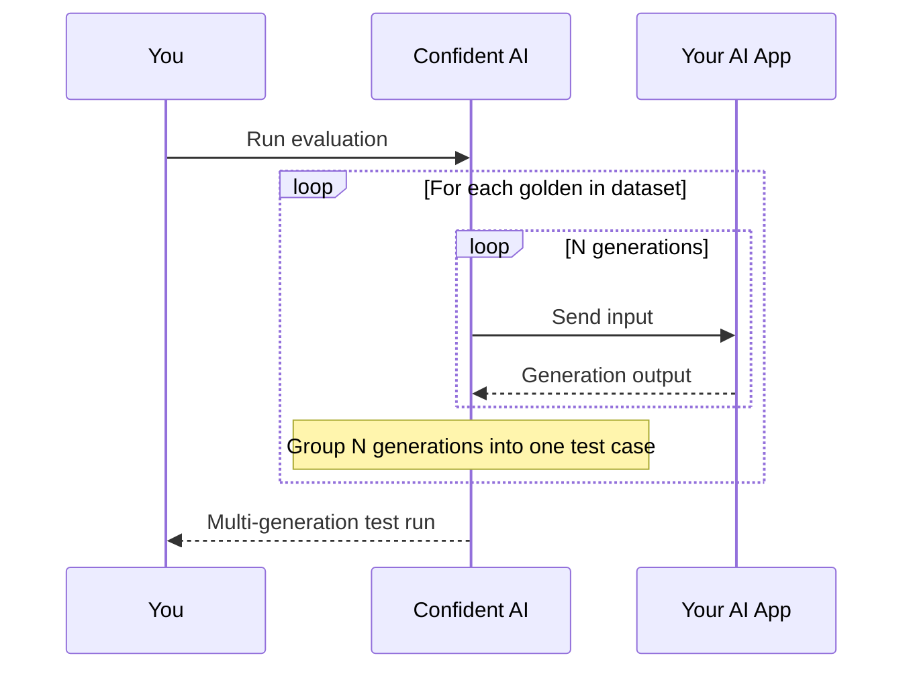

## Overview

Most AI apps are non-deterministic—run the same input twice (anything with `temperature > 0`) and you'll get two different outputs. A single generation per golden only tells you how your app did *that one time*, which makes it hard to know whether one test run genuinely beat another or just got lucky on a thin sample.

The **multi-generation factor** on your [AI Connection](/docs/settings/project/ai-connections) fixes this. Instead of calling your endpoint once per golden, Confident AI calls it multiple times, capturing several generations for each test case. More samples means Confident AI can separate real improvements from run-to-run noise.

<Frame caption="Set Default Generations on your AI Connection">
  
</Frame>

## Default Generations

You'll find the multi-generation factor in your AI Connection's [Throttling](/docs/settings/project/ai-connections/throttling-retries) tab, as the **Default Generations** field. It controls how many times Confident AI calls your endpoint for each golden in your dataset.

- **Minimum**: 1 (a single generation—the standard behavior)
- **Default**: 1

Set it to a value greater than 1 to enable multi-generation test runs. For example, a factor of `5` calls your endpoint five times for every golden, producing five generations per test case.

<Warning>
  Every extra generation is another request to your endpoint. A dataset of 100
  goldens with a factor of `5` sends **500** requests per test run. Tune
  [Throttling & Retries](/docs/settings/project/ai-connections/throttling-retries)
  so a higher factor doesn't overwhelm your AI app.
</Warning>

## How It Works

When you run an evaluation with a multi-generation factor greater than 1, Confident AI samples your endpoint repeatedly for each golden before moving on:

Each golden becomes a single test case that holds all `N` generations, rather than a one-off snapshot of a single output.

## Multi-Generation Test Runs

A test run built this way is a **multi-generation test run**. Because each test case carries several outputs instead of one, Confident AI can measure how much your app's scores vary from generation to generation—the spread that a single output would hide entirely.

Open any golden in a multi-generation test run and you'll see every generation side by side, with a **Consistency** column that summarizes how often it passed across all samples:

<Frame caption="A multi-generation test case with each generation displayed">
  
</Frame>

This unlocks **statistical significance** when comparing test runs in [Experiments](/docs/llm-evaluation/experiments):

- **Single generation** — you see one score per test case, so a difference between two runs could easily be noise.
- **Multiple generations** — you see the *distribution* of scores per test case, so Confident AI can tell you whether one version's win is statistically significant or just sampling luck.

<Tip>
  Higher factors give tighter confidence but cost more requests and time. A
  factor of `3`–`5` is usually enough to expose run-to-run variance without
  blowing up your request volume.
</Tip>

## Next Steps

With multi-generation sampling configured, put those richer test runs to work.

<CardGroup cols={2}>
  <Card
    title="Experiments"
    icon="fa-light fa-flask"
    href="/docs/llm-evaluation/experiments"
  >
    Compare versions of your AI app with statistical significance across
    multi-generation test runs.
  </Card>
  <Card
    title="Throttling & Retries"
    icon="fa-light fa-gauge-high"
    href="/docs/settings/project/ai-connections/throttling-retries"
  >
    Tune concurrency, timeouts, and retries so a higher factor doesn't overwhelm
    your endpoint.
  </Card>
</CardGroup>
