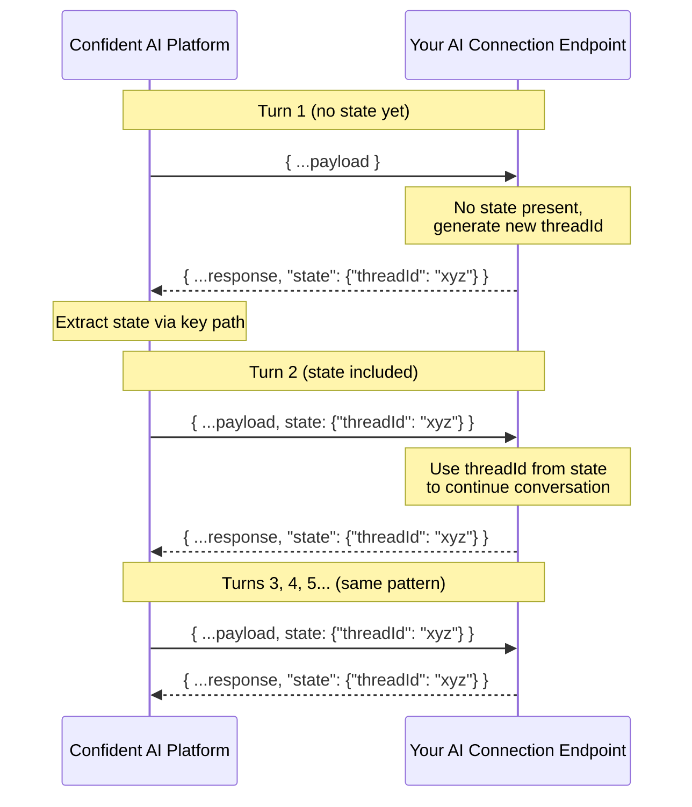

## Overview

During multi-turn simulations, Confident AI calls your [AI Connection](/docs/settings/project/ai-connections) endpoint once per turn. You can use state to persist information—like a thread ID or session—across turns so your AI app can maintain context throughout the conversation.

On the **first turn**, the `state` variable in your payload will be empty since no prior state exists. If your endpoint returns a state object and the state key path successfully extracts it, that state will be included in the `state` payload variable from the **second turn onwards**.



## Payload

To enable multiturn state, include `state` in your payload configuration so it gets sent to your endpoint on each turn:

```json
{
  "input": golden.input,
  "state": state
}
```

Here's an example of how your endpoint might handle state:

```python
@app.post("/generate")
def generate(request: dict):
    state = request.get("state", {})

    if not state:
        thread_id = create_new_thread()
    else:
        thread_id = state["threadId"]

    response = llm.generate(
        thread_id=thread_id,
        user=request["input"]
    )

    return {
        "output": response,
        "state": {"threadId": thread_id}
    }
```

## State Key Path

The state key path works just like the actual output key path—a list of strings or integers representing the path to the `state` object in your JSON response. This tells Confident AI where to extract state from your endpoint's response so it can be passed back on the next turn.

For example, if your endpoint returns:

```json
{
  "output": "Hello! How can I help?",
  "state": {
    "threadId": "abc-123"
  }
}
```

Set the state key path to `["state"]`.

<Note>
  State is only relevant for multi-turn evaluations (simulations). For
  single-turn evaluations, you can ignore this setting entirely.
</Note>

## Next Steps

Now that your AI connection can maintain context across turns, link each turn back to its trace for full observability.

<CardGroup cols={2}>
  <Card title="Linking Traces" icon="fa-light fa-link" href="/docs/settings/project/ai-connections/linking-traces">
    Link test cases and turns to their traces for full observability.
  </Card>
  <Card title="Multi-Turn Evals" icon="fa-light fa-comments" href="/docs/llm-evaluation/no-code/multi-turn">
    Run multi-turn evaluations against your AI connection.
  </Card>
</CardGroup>
