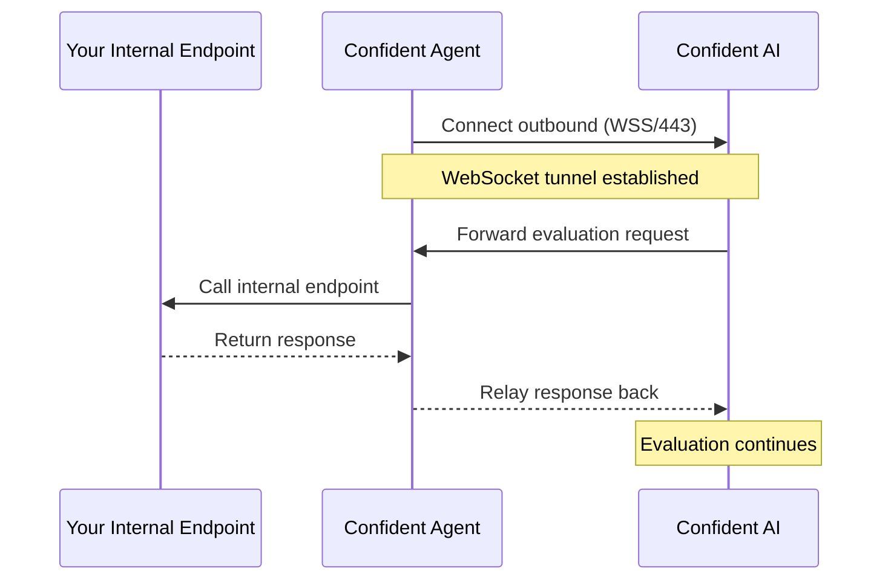

The Confident Agent is a lightweight bridge agent that allows Confident AI's evaluation server to reach internal API endpoints behind firewalls, without opening inbound ports. This is a feature available as part of [AI Connections](/docs/settings/project/ai-connections).

<Card title="GitHub Repository" icon="fa-brands fa-github" href="https://github.com/confident-ai/confident-agent">
  View the source code, report issues, and find the latest releases.
</Card>


## How It Works

The agent connects outbound via WebSocket Secure (WSS) to Confident AI's evaluation server and waits for work. When an evaluation runs, requests are forwarded through the WebSocket tunnel to your internal endpoint and responses are relayed back.

The Confident Agent supports the following response modes:

- **HTTP Response** — standard JSON responses
- **HTTP Streaming** — chunked HTTP streaming responses
- **SSE Streaming** — Server-Sent Events streaming responses



## Requirements

- **Outbound internet access** on port 443 (WSS) from the machine running the agent
- **Network access** from the agent to your internal API endpoint
- No inbound ports need to be opened

## Quick Start

### Docker Container (CLI)

Run the agent as a Docker container:

```bash
docker run -d \
  -e CONFIDENT_API_KEY=<your-api-key> \
  -e CONFIDENT_WS_BASE_URL=wss://deepeval.confident-ai.com/ws/relay \
  confidentai/confident-agent
```

### Docker Compose

Create a `compose.yaml` file:

```yaml
services:
  confident-agent:
    image: confidentai/confident-agent
    restart: unless-stopped
    environment:
      - CONFIDENT_API_KEY=${CONFIDENT_API_KEY}
      - CONFIDENT_WS_BASE_URL=${CONFIDENT_WS_BASE_URL:-wss://deepeval.confident-ai.com/ws/relay}
```

Then start the agent:

```bash
docker compose up -d
```

## Environment Variables

| Variable | Description | Required |
| --- | --- | --- |
| `CONFIDENT_API_KEY` | Your Confident AI API key | Yes |
| `CONFIDENT_WS_BASE_URL` | WebSocket relay URL | Yes |

## Using with AI Connections

Once the Confident Agent is running and connected, your [AI Connections](/docs/settings/project/ai-connections) can target internal endpoints that are not publicly accessible. The agent transparently tunnels requests from Confident AI's evaluation server to your internal endpoint—no changes to your AI Connection configuration are needed beyond pointing it to the internal URL.

<Tip>
  The agent handles reconnection automatically. If the WebSocket connection drops, it will re-establish the tunnel without manual intervention.
</Tip>
