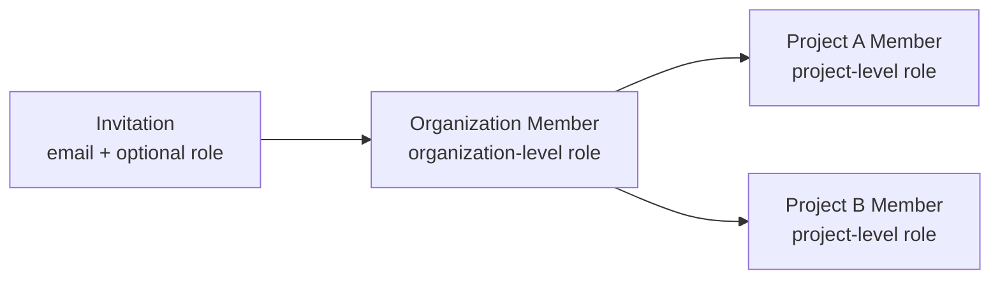

## Overview

Members are the people with access to your account, and they exist at two levels:

- **Organization members** belong to your entire organization. Invited users become organization members and can receive an organization-level role.
- **Project members** belong to a single project. Add organization members to projects to grant project access with a project-level role.

A user must be an organization member before they can be added to a project. New members join by accepting an invitation, and project membership grants access to specific projects.



<Note>

All methods on this page require an **Organization API Key**. See the [Quickstart](/docs/settings/project/management/quickstart) to create a client.

</Note>

## Members

You can manage the people in your organization and its individual projects.

### List Members

You can list members page by page; the listing defaults to `page=1` and `page_size=25`.

<Tabs>

<Tab title="Python" language="python">

```python
from confidentai import ConfidentAI

client = ConfidentAI()

org = client.organization()
project = client.project("clq9z3x1k0001la08f7t3g5p2")

# Organization members
members = org.members.list(page=1, page_size=25)

# Project members
project_members = project.members.list(page=1)
```

</Tab>

<Tab title="TypeScript" language="typescript">

```typescript
import { ConfidentAI } from "confidentai";

const client = new ConfidentAI();

const org = client.organization();
const project = client.project("clq9z3x1k0001la08f7t3g5p2");

// Organization members
const members = await org.members.list({ page: 1, pageSize: 25 });

// Project members
const projectMembers = await project.members.list({ page: 1 });
```

</Tab>

</Tabs>

### Update a Member's Role

You can assign a role to a member by their `user_id`. Roles are managed in the [Roles, Policies & Permissions](/docs/settings/project/management/roles-policies-permissions) section.

<Tabs>

<Tab title="Python" language="python">

```python
org = client.organization()
project = client.project("clq9z3x1k0001la08f7t3g5p2")

# Organization-level role
member = org.members.update_role("clq8n3p9k0002la09a1b7c4d2", role_id="b3f1c2a9-7d4e-4c1b-9a2f-1e6d8c0a4b7e")

# Project-level role
project_member = project.members.update_role("clq8n3p9k0002la09a1b7c4d2", role_id="b3f1c2a9-7d4e-4c1b-9a2f-1e6d8c0a4b7e")
```

</Tab>

<Tab title="TypeScript" language="typescript">

```typescript
const org = client.organization();
const project = client.project("clq9z3x1k0001la08f7t3g5p2");

// Organization-level role
const member = await org.members.updateRole("clq8n3p9k0002la09a1b7c4d2", {
  roleId: "b3f1c2a9-7d4e-4c1b-9a2f-1e6d8c0a4b7e",
});

// Project-level role
const projectMember = await project.members.updateRole("clq8n3p9k0002la09a1b7c4d2", {
  roleId: "b3f1c2a9-7d4e-4c1b-9a2f-1e6d8c0a4b7e",
});
```

</Tab>

</Tabs>

### Remove a Member

You can remove a member from your organization or a specific project by their `user_id`.

<Tabs>

<Tab title="Python" language="python">

```python
org = client.organization()
project = client.project("clq9z3x1k0001la08f7t3g5p2")

org.members.remove("clq8n3p9k0002la09a1b7c4d2")
project.members.remove("clq8n3p9k0002la09a1b7c4d2")
```

</Tab>

<Tab title="TypeScript" language="typescript">

```typescript
const org = client.organization();
const project = client.project("clq9z3x1k0001la08f7t3g5p2");

await org.members.remove("clq8n3p9k0002la09a1b7c4d2");
await project.members.remove("clq8n3p9k0002la09a1b7c4d2");
```

</Tab>

</Tabs>

## Invitations

You can invite new people to your organization or projects, and manage invitations that are still pending.

### List Invitations

You can list the pending invitations at the organization or project level.

<Tabs>

<Tab title="Python" language="python">

```python
org = client.organization()
project = client.project("clq9z3x1k0001la08f7t3g5p2")

invitations = org.invitations.list()
project_invitations = project.invitations.list()
```

</Tab>

<Tab title="TypeScript" language="typescript">

```typescript
const org = client.organization();
const project = client.project("clq9z3x1k0001la08f7t3g5p2");

const invitations = await org.invitations.list();
const projectInvitations = await project.invitations.list();
```

</Tab>

</Tabs>

### Create Invitations

You can invite one or more emails at once, and the optional `role_id` assigns a role to invitees when they join.

<Tabs>

<Tab title="Python" language="python">

```python
org = client.organization()
project = client.project("clq9z3x1k0001la08f7t3g5p2")

# Organization invitations
invitations = org.invitations.create(
    ["alice@example.com", "bob@example.com"],
    role_id="b3f1c2a9-7d4e-4c1b-9a2f-1e6d8c0a4b7e",
)

# Project invitations
project_invitations = project.invitations.create(
    ["alice@example.com"],
    role_id="b3f1c2a9-7d4e-4c1b-9a2f-1e6d8c0a4b7e",
)
```

</Tab>

<Tab title="TypeScript" language="typescript">

```typescript
const org = client.organization();
const project = client.project("clq9z3x1k0001la08f7t3g5p2");

// Organization invitations
const invitations = await org.invitations.create({
  emails: ["alice@example.com", "bob@example.com"],
  roleId: "b3f1c2a9-7d4e-4c1b-9a2f-1e6d8c0a4b7e",
});

// Project invitations
const projectInvitations = await project.invitations.create({
  emails: ["alice@example.com"],
  roleId: "b3f1c2a9-7d4e-4c1b-9a2f-1e6d8c0a4b7e",
});
```

</Tab>

</Tabs>

### Resend & Revoke Invitations

You can resend a pending invitation by its `invitation_id`, or revoke it to cancel access before it's accepted.

<Tabs>

<Tab title="Python" language="python">

```python
org = client.organization()
project = client.project("clq9z3x1k0001la08f7t3g5p2")

# Resend
org.invitations.resend(42)
project.invitations.resend(42)

# Revoke
org.invitations.revoke(42)
project.invitations.revoke(42)
```

</Tab>

<Tab title="TypeScript" language="typescript">

```typescript
const org = client.organization();
const project = client.project("clq9z3x1k0001la08f7t3g5p2");

// Resend
await org.invitations.resend(42);
await project.invitations.resend(42);

// Revoke
await org.invitations.revoke(42);
await project.invitations.revoke(42);
```

</Tab>

</Tabs>

## Next Steps

Define roles before assigning access to members:

<CardGroup cols={2}>
  <Card title="Roles, Policies & Permissions" icon="user-shield" href="/docs/settings/project/management/roles-policies-permissions">
    Create the roles you assign to members.
  </Card>
  <Card title="Projects" icon="folder" href="/docs/settings/project/management/projects">
    Manage the projects members belong to.
  </Card>
</CardGroup>
