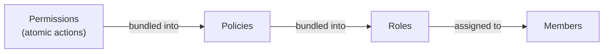

## Overview

Confident AI uses role-based access control (RBAC). Access is granted by composing three building blocks — you bundle permissions into policies, bundle policies into roles, then assign roles to members:

- **Permissions** are the atomic actions you can grant (e.g. `traces:read`). They are predefined by the platform, so you can only list them.
- **Policies** are named bundles of permissions.
- **Roles** are named bundles of policies that you assign to [members](/docs/settings/project/management/members-and-invitations).



Each building block exists independently at both the **organization** and **project** level. Organization-level roles govern access across the organization, while project-level roles govern access within a single project. To learn more about RBAC concepts, see [RBAC](/docs/settings/rbac).

<Note>

All methods on this page require an **Organization API Key**. See the [Quickstart](/docs/settings/project/management/quickstart) to create a client. Permissions, policies, and roles are grouped under the **`iam`** namespace on both clients — `client.organization().iam` and `client.project(id).iam`.

</Note>

## Permissions

Permissions are read-only. List them to discover the `id`s to attach to policies.

<Tabs>

<Tab title="Python" language="python">

```python
from confidentai import ConfidentAI

client = ConfidentAI()

org = client.organization()
project = client.project("clq9z3x1k0001la08f7t3g5p2")

permissions = org.iam.permissions.list()
project_permissions = project.iam.permissions.list()
```

</Tab>

<Tab title="TypeScript" language="typescript">

```typescript
import { ConfidentAI } from "confidentai";

const client = new ConfidentAI();

const org = client.organization();
const project = client.project("clq9z3x1k0001la08f7t3g5p2");

const permissions = await org.iam.permissions.list();
const projectPermissions = await project.iam.permissions.list();
```

</Tab>

</Tabs>

## Policies

A policy bundles permissions together. Provide `permission_ids` from the permissions listing above.

### List, Create, Update & Delete Policies

Each policy takes a `name`, a list of `permission_ids`, and an optional `description`.

<Tabs>

<Tab title="Python" language="python">

```python
org = client.organization()
project = client.project("clq9z3x1k0001la08f7t3g5p2")

# List
policies = org.iam.policies.list()
project_policies = project.iam.policies.list()

# Create
policy = org.iam.policies.create(
    "Dataset Editor",
    permission_ids=["5e9a1c3d-7b2f-4e8a-9c1d-3a6b5f0e2d4c", "8d2c4f6a-1e3b-4c7d-9a5e-2b8f1d0c6a3e"],
    description="Can edit datasets",
)

# Update
policy = org.iam.policies.update(
    "a17c4e2d-9b3f-4a6c-8d1e-2f5a9c3b7e0d",
    name="Dataset Editor",
    permission_ids=["5e9a1c3d-7b2f-4e8a-9c1d-3a6b5f0e2d4c", "8d2c4f6a-1e3b-4c7d-9a5e-2b8f1d0c6a3e", "2a7e9c1d-4b6f-4a8c-1d3e-7f5a9b2c0e4d"],
)

# Delete
org.iam.policies.delete("a17c4e2d-9b3f-4a6c-8d1e-2f5a9c3b7e0d")
```

</Tab>

<Tab title="TypeScript" language="typescript">

```typescript
const org = client.organization();
const project = client.project("clq9z3x1k0001la08f7t3g5p2");

// List
const policies = await org.iam.policies.list();
const projectPolicies = await project.iam.policies.list();

// Create
const policy = await org.iam.policies.create({
  name: "Dataset Editor",
  permissionIds: ["5e9a1c3d-7b2f-4e8a-9c1d-3a6b5f0e2d4c", "8d2c4f6a-1e3b-4c7d-9a5e-2b8f1d0c6a3e"],
  description: "Can edit datasets",
});

// Update
const updated = await org.iam.policies.update("a17c4e2d-9b3f-4a6c-8d1e-2f5a9c3b7e0d", {
  name: "Dataset Editor",
  permissionIds: ["5e9a1c3d-7b2f-4e8a-9c1d-3a6b5f0e2d4c", "8d2c4f6a-1e3b-4c7d-9a5e-2b8f1d0c6a3e", "2a7e9c1d-4b6f-4a8c-1d3e-7f5a9b2c0e4d"],
});

// Delete
await org.iam.policies.delete("a17c4e2d-9b3f-4a6c-8d1e-2f5a9c3b7e0d");
```

</Tab>

</Tabs>

<Tip>

Project-scoped policies use the same list, create, update, and delete operations as organization-scoped policies.

</Tip>

## Roles

A role bundles policies together and is assigned to members. Provide `policy_ids` from the policies above.

### List, Create, Update & Delete Roles

Each role takes a `name`, a list of `policy_ids`, and an optional `description`.

<Tabs>

<Tab title="Python" language="python">

```python
org = client.organization()
project = client.project("clq9z3x1k0001la08f7t3g5p2")

# List
roles = org.iam.roles.list()
project_roles = project.iam.roles.list()

# Create
role = org.iam.roles.create(
    "Data Scientist",
    policy_ids=["a17c4e2d-9b3f-4a6c-8d1e-2f5a9c3b7e0d"],
    description="Read/write datasets and prompts",
)

# Update
role = org.iam.roles.update(
    "b3f1c2a9-7d4e-4c1b-9a2f-1e6d8c0a4b7e",
    name="Data Scientist",
    policy_ids=["a17c4e2d-9b3f-4a6c-8d1e-2f5a9c3b7e0d", "c4f8a2e6-1d3b-4e9a-8c7d-5b2f1a0e6d3c"],
)

# Delete
org.iam.roles.delete("b3f1c2a9-7d4e-4c1b-9a2f-1e6d8c0a4b7e")
```

</Tab>

<Tab title="TypeScript" language="typescript">

```typescript
const org = client.organization();
const project = client.project("clq9z3x1k0001la08f7t3g5p2");

// List
const roles = await org.iam.roles.list();
const projectRoles = await project.iam.roles.list();

// Create
const role = await org.iam.roles.create({
  name: "Data Scientist",
  policyIds: ["a17c4e2d-9b3f-4a6c-8d1e-2f5a9c3b7e0d"],
  description: "Read/write datasets and prompts",
});

// Update
const updated = await org.iam.roles.update("b3f1c2a9-7d4e-4c1b-9a2f-1e6d8c0a4b7e", {
  name: "Data Scientist",
  policyIds: ["a17c4e2d-9b3f-4a6c-8d1e-2f5a9c3b7e0d", "c4f8a2e6-1d3b-4e9a-8c7d-5b2f1a0e6d3c"],
});

// Delete
await org.iam.roles.delete("b3f1c2a9-7d4e-4c1b-9a2f-1e6d8c0a4b7e");
```

</Tab>

</Tabs>

<Tip>

Project-scoped roles use the same list, create, update, and delete operations as organization-scoped roles.

</Tip>

## Next Steps

With your roles defined, assign them to your team:

<CardGroup cols={2}>
  <Card title="Members & Invitations" icon="user-group" href="/docs/settings/project/management/members-and-invitations">
    Assign roles to members and invitees.
  </Card>
  <Card title="RBAC" icon="user-shield" href="/docs/settings/rbac">
    Understand the RBAC model in depth.
  </Card>
</CardGroup>
