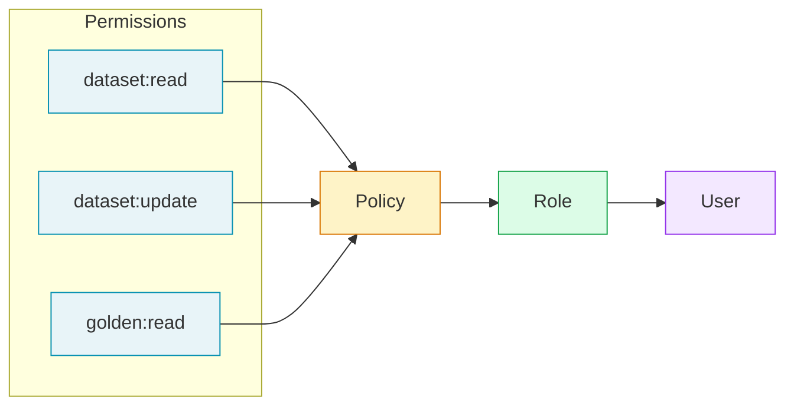

Role-based access control (RBAC) lets you define what each team member can do. This structure applies at both the **project** and **organization** level, though the specific permissions available are different for each.

## How It Works

A **permission** is a specific action like reading traces or editing datasets. Multiple permissions are grouped together into a **policy**, and each **role** is assigned a policy that defines what users with that role can access.

## Scope

Roles exist at two levels:

- **Project roles** control what a user can do within a specific project (e.g., access to datasets, traces, test runs).
- **Organization roles** control what a user can do across the organization (e.g., managing projects, users, billing).

A user can only have one role per project and one role at the organization level. The same user can have different project roles across different projects—for example, an "Annotator" with limited dataset access in one project, while having full "Owner" access in another.

## Why Configure RBAC?

As your team grows, not everyone needs access to everything. RBAC helps you:

- **Reduce risk** — Limit who can delete data or modify critical configurations.
- **Simplify onboarding** — Assign new team members a role instead of configuring individual permissions.
- **Support specialized workflows** — Create annotator roles for labeling teams, read-only roles for stakeholders, or manager roles for team leads.
- **Meet compliance requirements** — Many security frameworks require least-privilege access controls.
